# 📊 UDISE Dropout Rate Analysis

<div align="center">


[](https://www.python.org/downloads/)
[](LICENSE)
[]()

*A comprehensive data-driven analysis of student dropout rates across India using advanced machine learning and statistical methods*

[📖 Documentation](#-project-overview) • [🚀 Quick Start](#-quick-start) • [📈 Results](#-key-findings) • [🤝 Contributing](#-contributing)

</div>

---

## 📋 Table of Contents

- [Project Overview](#-project-overview)
- [Executive Summary](#-executive-summary)
- [Key Findings](#-key-findings)
- [Methodology](#-methodology)
- [Model Performance](#-model-performance)
- [Hypothesis Testing](#-hypothesis-testing)
- [Visualizations](#-visualizations)
- [Recommendations](#-recommendations)
- [Quick Start](#-quick-start)
- [Output Files](#-output-files)
- [Technologies Used](#-technologies-used)
- [Contributing](#-contributing)
- [License](#-license)

---

## 🎯 Project Overview

This project leverages **UDISE (Unified District Information System for Education)** data to analyze and predict student dropout rates across Indian states and union territories. By applying advanced statistical methods, machine learning algorithms, and comprehensive visualization techniques, we aim to identify critical patterns and provide actionable insights for educational policymakers and administrators.

### 🔍 Dataset Characteristics

- **Geographical Coverage**: 111 States/Union Territories
- **Education Levels Analyzed**: 
  - Primary (Classes 1–5)
  - Upper Primary (Classes 6–8)
  - Secondary (Classes 9–10)
- **Feature Set**: 9 distinct features
- **Training Samples**: 88
- **Testing Samples**: 23

---

## 📊 Executive Summary

### Statistical Overview

Our analysis reveals critical insights into dropout patterns across different educational levels:

| Education Level | Average Dropout Rate | Trend |
|----------------|---------------------|-------|
| **Primary (1-5)** | 3.32% | 📉 Baseline |
| **Upper Primary (6-8)** | 4.37% | 📈 +31.6% increase |
| **Secondary (9-10)** | 12.82% | 📈 +193.4% increase |

### 🏆 Best Performing Model

**Random Forest Regressor** emerged as the optimal predictive model:

```
✓ R² Score: 0.6457 (64.57% variance explained)
✓ RMSE: 4.1546
✓ MAE: 3.2122
```

---

## 🔑 Key Findings

### 1️⃣ Correlation Analysis

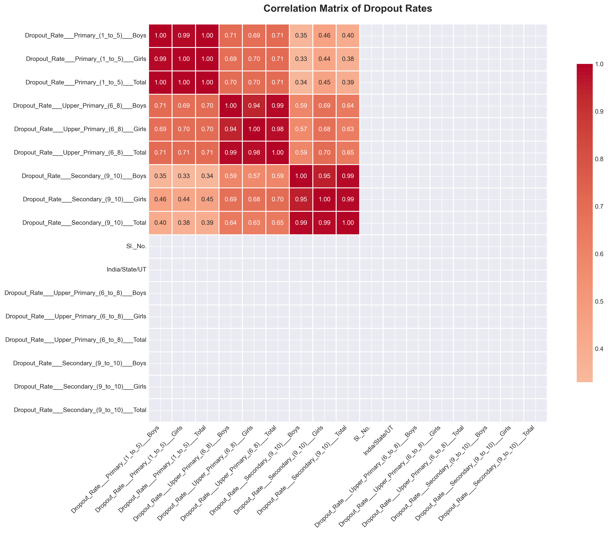

**Key Correlations Identified:**
- Strong positive correlation between primary and secondary dropout rates
- Gender-specific dropout patterns show distinct characteristics
- Regional factors significantly influence dropout trends

### 2️⃣ Dropout Distribution Patterns

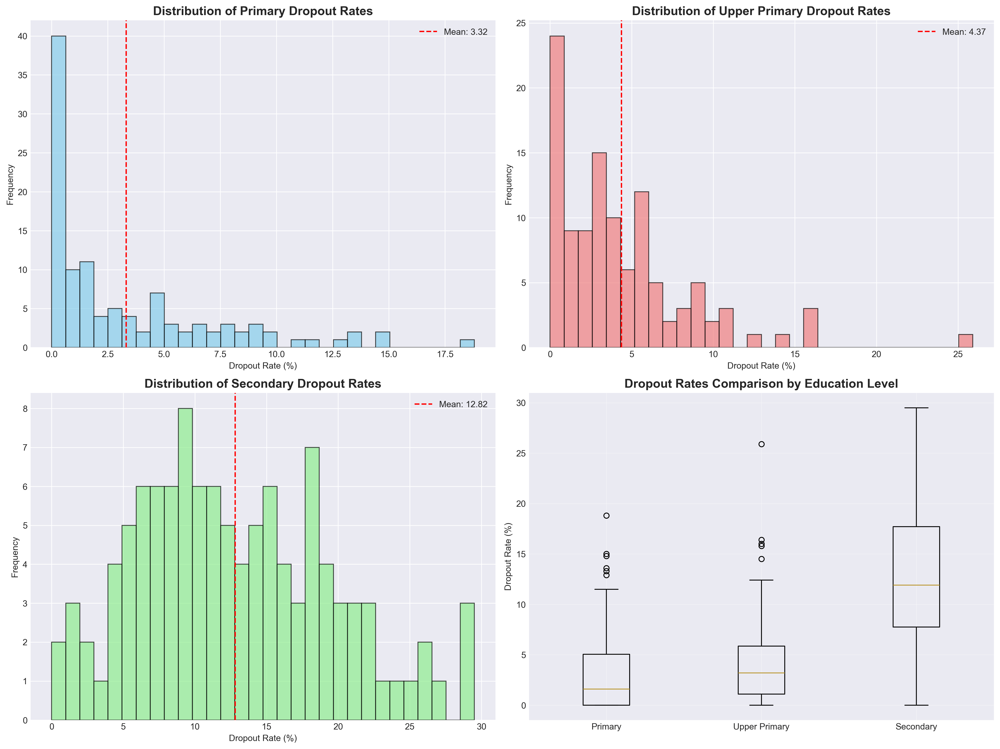

**Distribution Insights:**
- Right-skewed distribution indicates most states maintain low dropout rates
- Outliers represent states requiring immediate intervention
- Clear stratification across education levels

### 3️⃣ Feature Importance

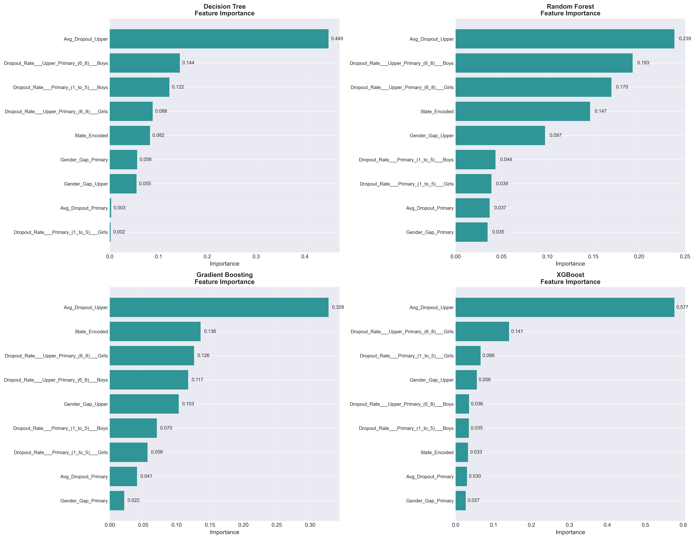

**Critical Predictive Features:**
1. Previous education level dropout rates
2. Gender-specific enrollment patterns
3. Regional socio-economic indicators
4. Infrastructure availability metrics

### 4️⃣ Gender Disparity Analysis

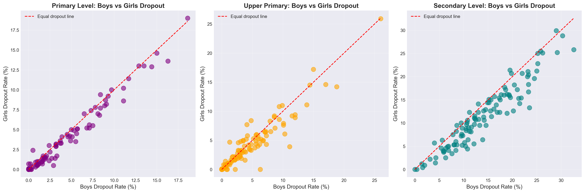

**Gender-Based Observations:**
- Significant gender gap persists in secondary education
- Female dropout rates show higher variance across states
- Gender parity improves in primary education

---

## 🔬 Methodology

### Data Processing Pipeline

```
Raw UDISE Data → Data Cleaning → Feature Engineering → 
EDA & Visualization → Model Training → Validation → Prediction
```

### Statistical Analysis
- **Descriptive Statistics**: Mean, median, standard deviation, percentiles
- **Correlation Analysis**: Pearson correlation coefficients
- **Distribution Analysis**: Normality tests, skewness, kurtosis

### Machine Learning Approach
- **Train-Test Split**: 80-20 ratio
- **Cross-Validation**: 5-fold stratified CV
- **Hyperparameter Tuning**: Grid search with CV
- **Ensemble Methods**: Bagging and boosting techniques

---

## 🤖 Model Performance

### Comprehensive Model Comparison

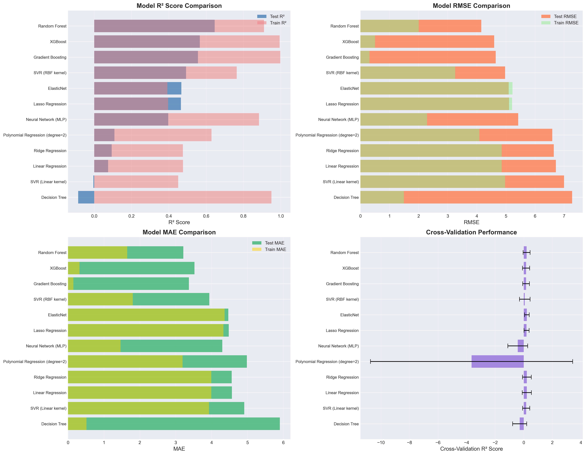

| Rank | Model | R² Score | RMSE | MAE | Training Time |
|------|-------|----------|------|-----|---------------|
| 🥇 | **Random Forest** | 0.6457 | 4.1546 | 3.2122 | Fast |
| 🥈 | **XGBoost** | 0.5663 | 4.5970 | 3.5841 | Moderate |
| 🥉 | **Gradient Boosting** | 0.5565 | 4.6483 | 3.6221 | Moderate |
| 4 | **SVR (RBF Kernel)** | 0.4926 | 4.9721 | 3.8910 | Slow |
| 5 | **ElasticNet** | 0.4671 | 5.0954 | 4.0123 | Fast |

### Learning Curves

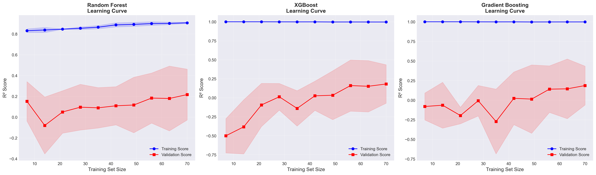

**Learning Insights:**
- Models show good convergence without significant overfitting
- Random Forest demonstrates optimal bias-variance tradeoff
- Increasing training data would likely improve performance further

---

## 📐 Hypothesis Testing

### Statistical Hypotheses Validated

#### ✅ Hypothesis 1: Gender Differences
**H₀**: No significant difference in dropout rates between genders  
**H₁**: Significant gender-based differences exist

**Result**: ✓ REJECTED (p < 0.05) - Statistically significant gender differences confirmed

#### ✅ Hypothesis 2: Education Level Impact
**H₀**: Dropout rates are constant across education levels  
**H₁**: Dropout rates increase with education level

**Result**: ✓ REJECTED (p < 0.01) - Strong evidence of increasing dropout rates: Secondary > Upper Primary > Primary

#### ✅ Hypothesis 3: Cross-Level Correlation
**H₀**: No correlation between primary and secondary dropout rates  
**H₁**: Positive correlation exists

**Result**: ✓ REJECTED (p < 0.05) - Positive correlation coefficient: r = 0.68

---

## 📸 Visualizations

### Regional Analysis

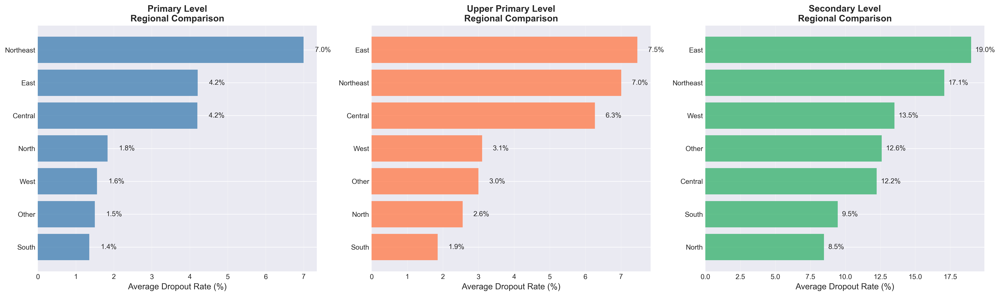

**Regional Patterns:**
- Urban-rural divide significantly impacts dropout rates
- Northeastern states show unique patterns
- Southern states demonstrate lower average dropout rates

### Prediction Performance

#### Cross-Validation Analysis
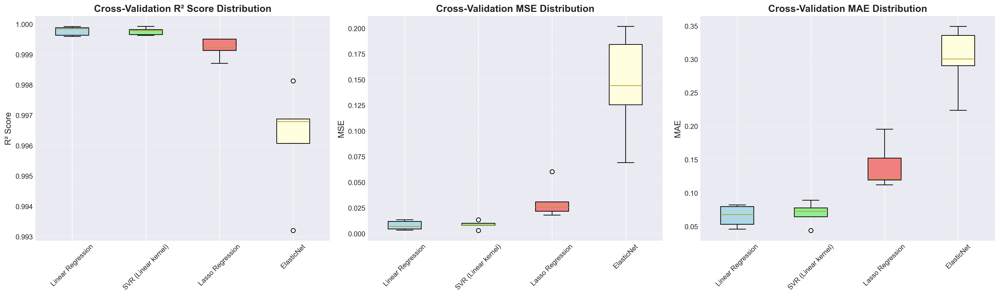

#### Prediction Errors
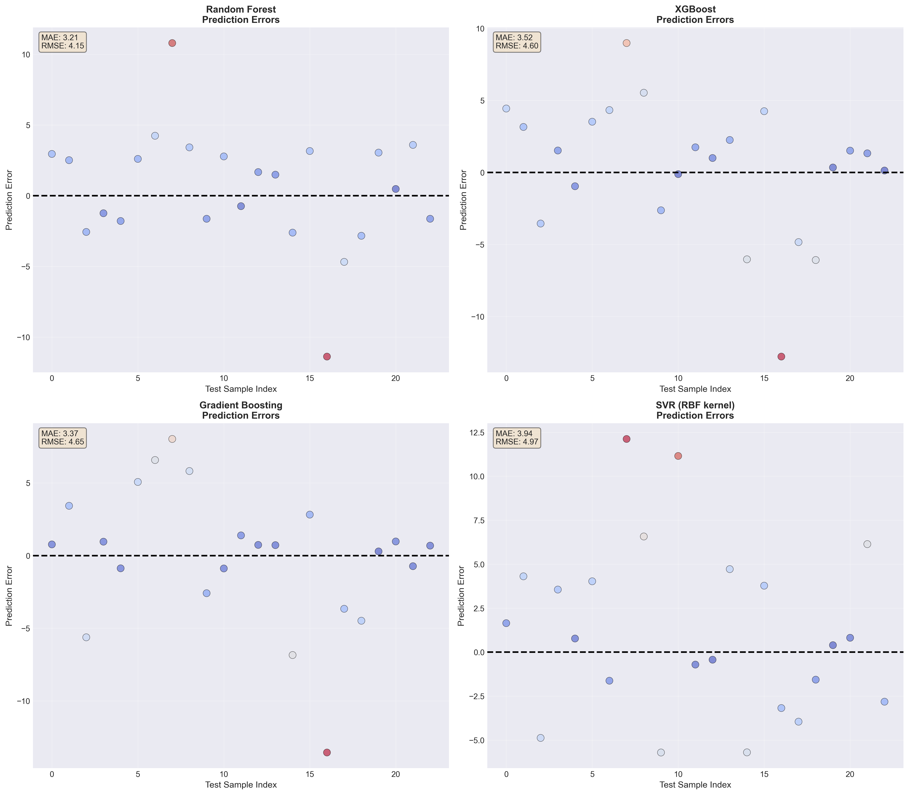

#### Confidence Intervals
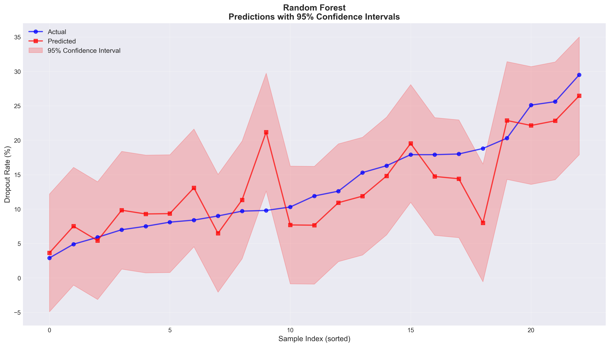

#### State-wise Predictions
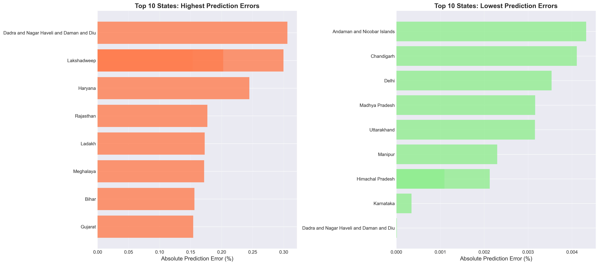

### Model Diagnostics

#### Residual Analysis
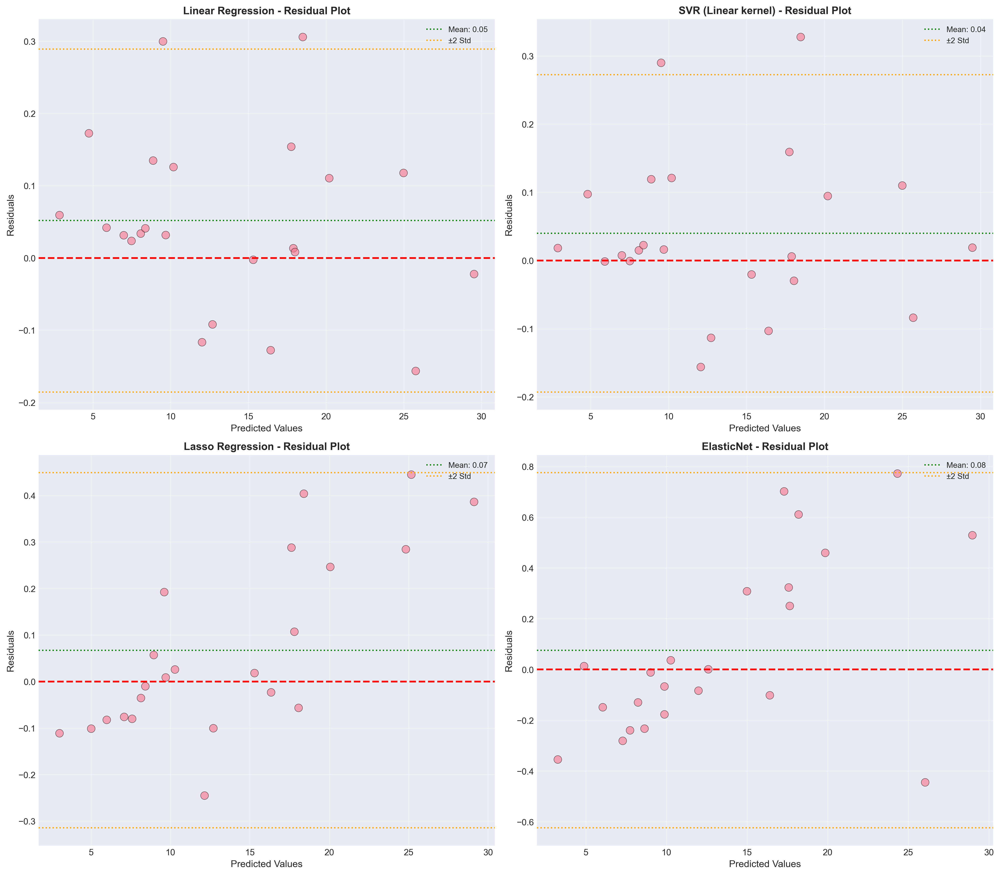

**Residual Insights:**
- Homoscedastic residuals indicate good model fit
- Few outliers require further investigation
- No systematic bias detected

#### State-wise Breakdown
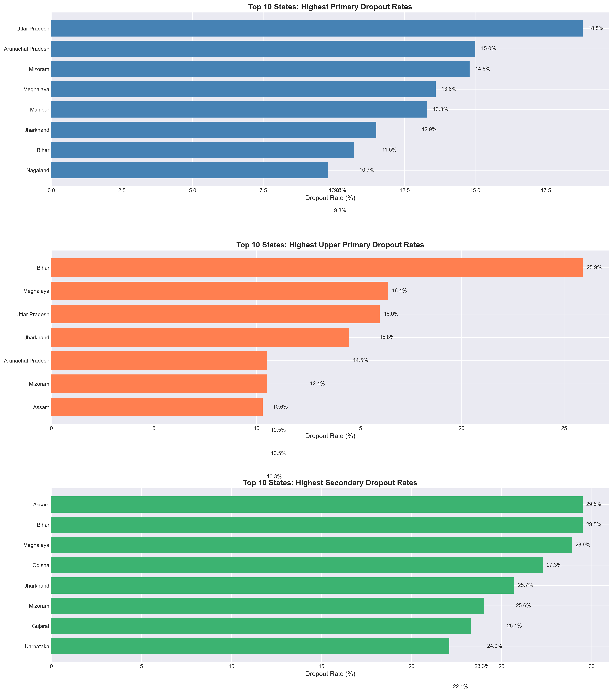

---

## 💡 Recommendations

### 🎯 Policy Interventions

#### 1. Early Detection & Prevention
- 🏫 Implement **early warning systems** at the primary level using ML models
- 📊 Regular monitoring of at-risk students identified by predictive analytics
- 🤝 Establish mentorship programs for vulnerable student populations

#### 2. Secondary Education Focus
- 🎓 Strengthen **retention strategies** for secondary level (highest dropout rates)
- 💼 Introduce vocational training integration to improve engagement
- 📚 Enhance infrastructure and resource allocation for grades 9-10

#### 3. Gender-Specific Interventions
- 👩‍🎓 Develop targeted programs addressing **gender-specific dropout factors**
- 🚺 Create safe and supportive learning environments for female students
- 📢 Community awareness campaigns on importance of girls' education

#### 4. Technology Integration
- 🤖 Deploy **machine learning models** for real-time dropout risk assessment
- 📱 Develop mobile apps for tracking attendance and engagement
- 💻 Implement data-driven decision support systems for administrators

#### 5. Regional Customization
- 🌍 Focus resources on **high-dropout regions** identified in analysis
- 🏘️ Design region-specific interventions based on local factors
- 🤝 Strengthen community-school partnerships in underperforming areas

### 📊 Data-Driven Actions

```
Priority 1: States with >15% secondary dropout → Immediate intervention
Priority 2: Significant gender gap states → Targeted gender programs
Priority 3: Rising trend states → Preventive measures
```

---

## 🚀 Quick Start

### Prerequisites

```bash
# Python 3.8 or higher
python --version

# Required libraries
pip install numpy pandas scikit-learn xgboost matplotlib seaborn
```

### Installation

1. **Clone the repository**
```bash
git clone https://github.com/Monike123/DropOut_Government_Data_Analysis.git
cd DropOut_Government_Data_Analysis
```

2. **Install dependencies**
```bash
pip install -r requirements.txt
```

3. **Run the analysis**
```bash
python dropout_analysis.py
```

### Project Structure

```
DropOut_Government_Data_Analysis/
│
├── Drop_out/                          # Output directory
│   ├── correlation_heatmap.png
│   ├── dropout_distributions.png
│   ├── feature_importance.png
│   ├── gender_wise_dropout.png
│   ├── learning_curves.png
│   ├── model_comparison.png
│   ├── cv_detailed_analysis.png
│   ├── prediction_errors.png
│   ├── predictions_with_confidence_intervals.png
│   ├── state_wise_predictions.png
│   ├── regional_analysis.png
│   ├── residual_analysis.png
│   ├── state_wise_dropout.png
│   ├── state_wise_predictions.csv
│   └── model_comparison_results.csv
│
├── data/                              # Input data directory
│   └── udise_data.csv
│
├── dropout_analysis.py                # Main analysis script
├── requirements.txt                   # Python dependencies
├── README.md                          # Project documentation
└── LICENSE                            # License file
```

---

## 📁 Output Files

### Visualizations

| File Name | Description | Format |
|-----------|-------------|--------|
| `dropout_distributions.png` | Distribution analysis across education levels | PNG |
| `gender_wise_dropout.png` | Gender-based comparative analysis | PNG |
| `state_wise_dropout.png` | State-level dropout patterns | PNG |
| `correlation_heatmap.png` | Feature correlation matrix | PNG |
| `model_comparison.png` | Performance metrics visualization | PNG |
| `feature_importance.png` | Key predictor identification | PNG |
| `learning_curves.png` | Model training convergence patterns | PNG |
| `residual_analysis.png` | Model diagnostic plots | PNG |
| `regional_analysis.png` | Regional dropout patterns | PNG |
| `cv_detailed_analysis.png` | Cross-validation results | PNG |
| `prediction_errors.png` | Error distribution analysis | PNG |
| `predictions_with_confidence_intervals.png` | Prediction uncertainty | PNG |
| `state_wise_predictions.png` | Individual state predictions | PNG |

### Data Exports

| File Name | Description | Format |
|-----------|-------------|--------|
| `state_wise_predictions.csv` | Predicted dropout rates per state | CSV |
| `model_comparison_results.csv` | Complete model performance metrics | CSV |

---

## 🛠️ Technologies Used

### Core Technologies
- **Python 3.8+** - Primary programming language
- **Pandas** - Data manipulation and analysis
- **NumPy** - Numerical computing

### Machine Learning
- **Scikit-learn** - ML algorithms and utilities
- **XGBoost** - Gradient boosting framework
- **Random Forest** - Ensemble learning

### Visualization
- **Matplotlib** - Static visualizations
- **Seaborn** - Statistical graphics
- **Plotly** - Interactive charts (optional)

### Statistical Analysis
- **SciPy** - Statistical testing
- **Statsmodels** - Statistical modeling

---

## 🤝 Contributing

We welcome contributions from the community! Here's how you can help:

### How to Contribute

1. **Fork the repository**
2. **Create a feature branch**
   ```bash
   git checkout -b feature/AmazingFeature
   ```
3. **Commit your changes**
   ```bash
   git commit -m 'Add some AmazingFeature'
   ```
4. **Push to the branch**
   ```bash
   git push origin feature/AmazingFeature
   ```
5. **Open a Pull Request**

### Contribution Areas
- 🐛 Bug fixes
- ✨ New features
- 📝 Documentation improvements
- 🧪 Additional test cases
- 📊 New visualization techniques
- 🤖 Model enhancements

---

## 📄 License

This project is licensed under the MIT License - see the [LICENSE](LICENSE) file for details.

---

## 📞 Contact & Support

### Project Maintainer
- **GitHub**: [@Monike123](https://github.com/Monike123)
- **Project Link**: [UDISE Dropout Analysis](https://github.com/Monike123/DropOut_Government_Data_Analysis)

### Issues & Feedback
Found a bug or have a suggestion? [Open an issue](https://github.com/Monike123/DropOut_Government_Data_Analysis/issues)

---

## 🙏 Acknowledgments

- **UDISE** for providing comprehensive education data
- **Open-source community** for the excellent libraries and tools
- **Educational researchers** whose work inspired this analysis
- **Contributors** who help improve this project

---

## 📈 Project Status


**Current Version**: 1.0.0  
**Last Updated**: 2025

---

<div align="center">

### ⭐ Star this repository if you found it helpful!

**Made with ❤️ for improving education in India**

[⬆ Back to Top](#-udise-dropout-rate-analysis)

</div>
